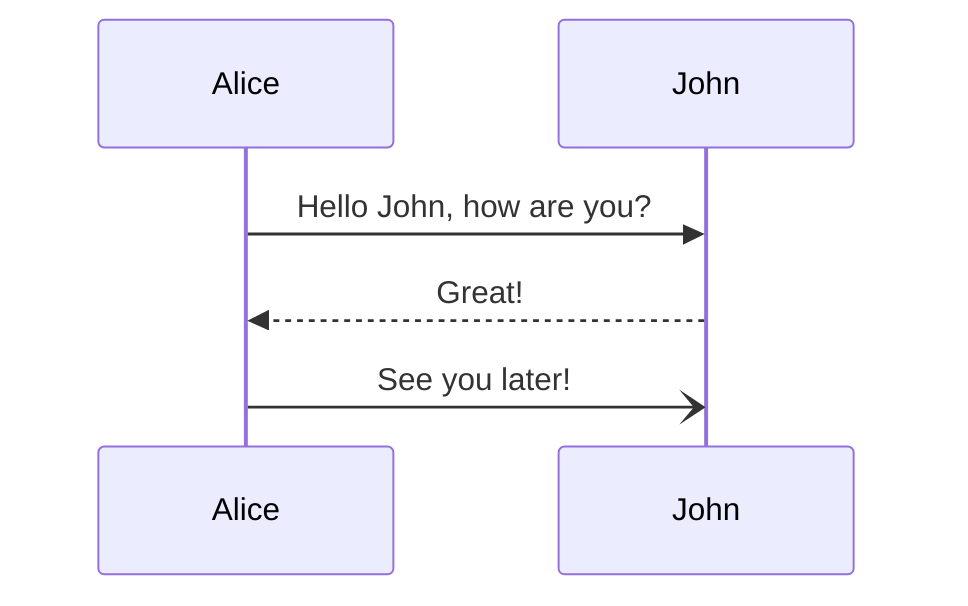

# Test Mermaid




```mermaid
flowchart TD
    A{Is picker available}
    B(Get picker with 
      least workload)
    C(Wait a picker to
      be available)
    D(Travel to station)

    A-->C --> A
    A-->B 
    B-->D
````


## Merging Point (Outside Loop)

```mermaid
flowchart TD
    A("Travel to merging 
        point")
    B{"Entering the loop?"}
    C{"Does loop 
        have space?"}
    D(Wait for window)
    E((Merge))

    F{Is out channel free?}
    G("Recirculate")


    A-->B
    B-->|Yes|C -->|No| D --> C
    C --> |Yes| E

    F --> |Yes|H(("Travel to out 
                   station"))  
    B -->  F --> |No|G -->A
````